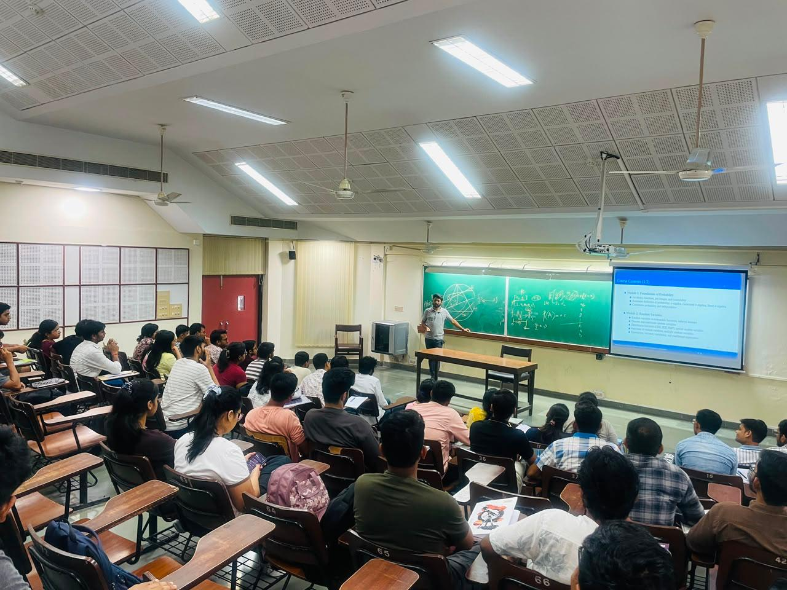
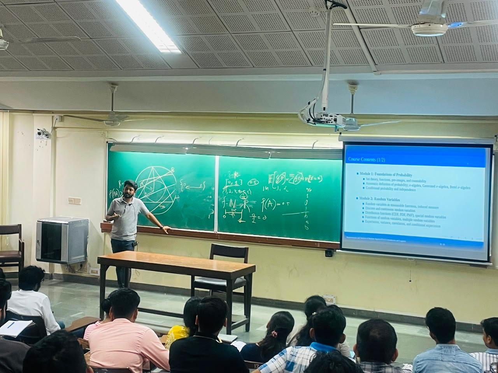
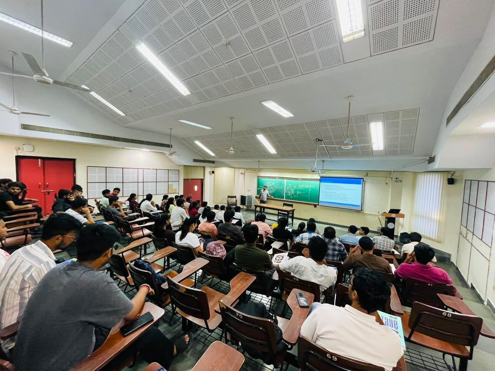
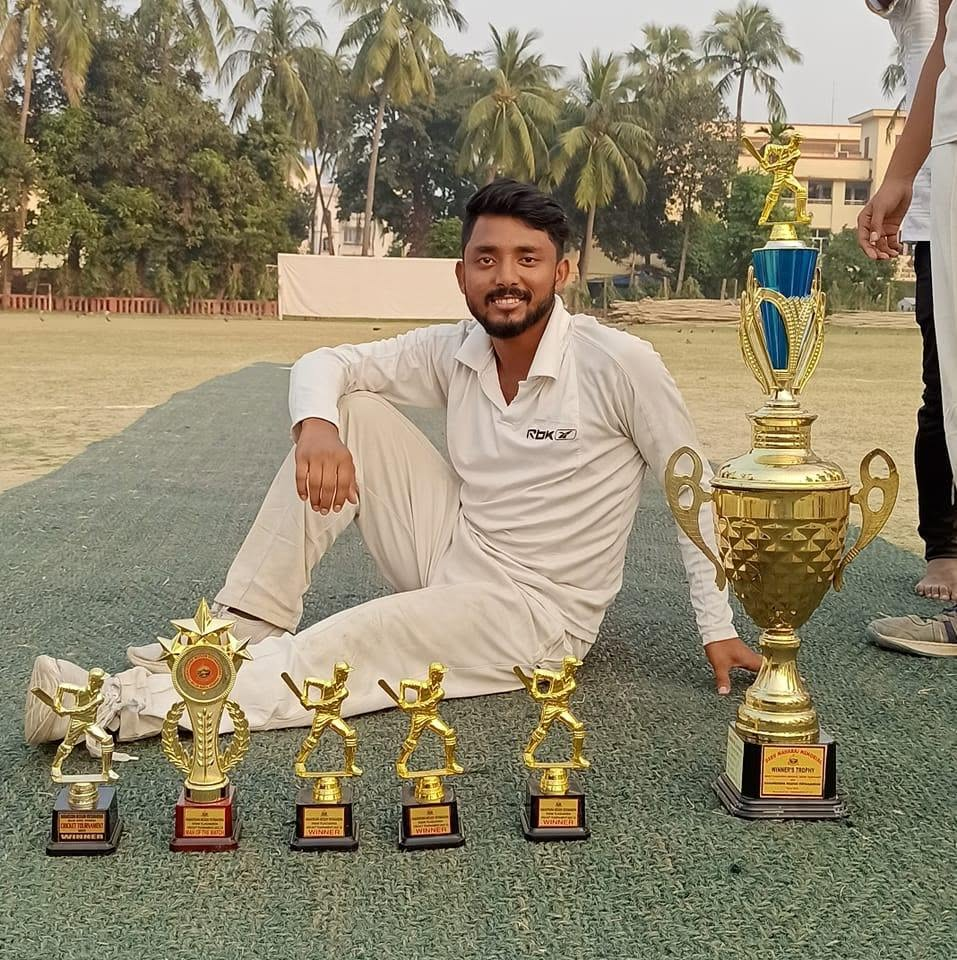
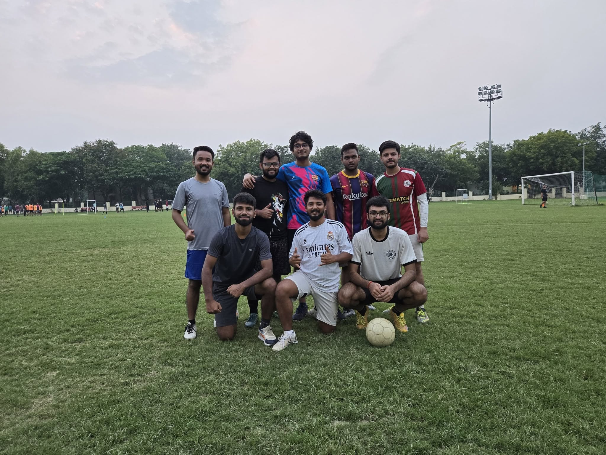
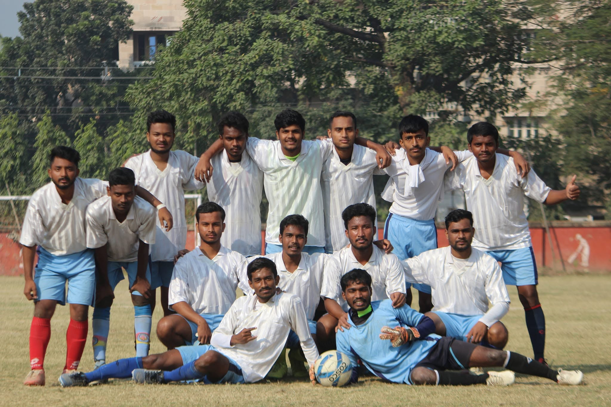
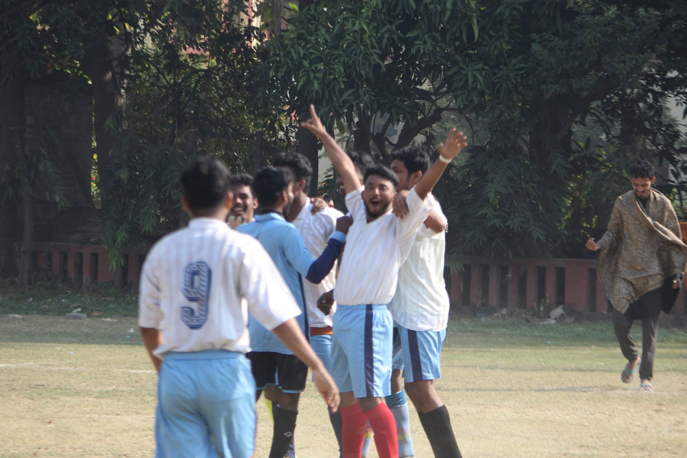

<div align="center">

# 👋 Hello, I'm Pankaj Kumar Barman

### Theoretical Reinforcement Learning Researcher

**MS by Research in Electrical Engineering · IIT Kanpur**

I work on the **theoretical foundations of Reinforcement Learning**, with a focus on
**average-reward and constrained MDPs, neural actor-critic methods, convergence analysis,
sample-efficient learning, and sequential decision-making under uncertainty.**

<br>

<a href="https://scholar.google.com/citations?user=-4oPk8kAAAAJ&hl=en">

</a>
<a href="https://www.linkedin.com/in/pankaj-kumar-barman-5a66761a7/">

</a>
<a href="mailto:pankajkb24@iitk.ac.in">

</a>

</div>

---

## 🔬 Research Interests

My primary research interests lie in:

* **Reinforcement Learning:** Average-Reward RL, Constrained MDPs, Robust RL,
  Actor-Critic Methods, Natural Policy Gradients, Policy Optimization
* **Learning Theory:** Global Convergence, Finite-Time Guarantees,
  Neural Function Approximation, Neural Tangent Kernels, Sample-Efficient Learning
* **Sequential Decision-Making & Control:** Infinite-Horizon RL, Markovian Sampling,
  Uncertainty-Aware Learning, Learning-Based Control, Dynamical Systems
* **Optimization & Stochastic Methods:** Primal-Dual Optimization, Lagrangian Methods,
  Multi-Level Monte Carlo, Statistical Estimation

I am particularly interested in understanding **how learning algorithms can make reliable
sequential decisions when data are dependent, environments are uncertain, and policies
or value functions are represented by neural networks.**

---

## 🧠 Current Research

I am currently completing my **MS by Research in Electrical Engineering at IIT Kanpur**,
under the supervision of **Prof. Washim Uddin Mondal**.

My research focuses on the theoretical analysis of neural actor-critic algorithms for
**average-reward and constrained MDPs**, with particular emphasis on:

* Global and finite-time convergence
* Neural function approximation
* Markovian sampling and temporal dependence
* Natural Policy Gradients
* Primal-dual optimization
* Multi-Level Monte Carlo (MLMC)
* Neural Tangent Kernel (NTK) analysis
* Sample-efficient reinforcement learning
* Robust and uncertainty-aware RL

---

## 📚 Publications

### Global Convergence of Average Reward Constrained MDPs with Neural Critic and General Policy Parameterization

**Anirudh Satheesh, Pankaj Kumar Barman, Washim Uddin Mondal, Vaneet Aggarwal**

**UAI 2026**

[📄 Paper](https://arxiv.org/abs/2603.07698)

The work develops **PDNAC-NC**, a primal-dual Natural Actor-Critic framework
for infinite-horizon constrained MDPs with multi-layer neural critics and
general policy parameterizations.

Key contributions include:

* Nested **Multi-Level Monte Carlo estimation** under Markovian sampling
* Neural Tangent Kernel analysis for nonlinear critic approximation
* Global convergence guarantees
* Cumulative constraint violation of $\mathcal{O}(T^{-1/4})$
* Theoretical analysis beyond the traditional linear-critic setting

---

## 📝 Research Manuscript

### Optimal Convergence Rate for Average-Reward RL with General Parameterized Actor and Neural Critic

**Joel Bansal, Pankaj Kumar Barman, Vaneet Aggarwal, Washim Uddin Mondal**

Current manuscript on sample-efficient average-reward RL with:

* Neural critics
* General policy parameterizations
* Natural Actor-Critic methods
* Continuous state-action spaces
* Markovian sampling

The work develops **ARNAC-DD** and establishes a
$\widetilde{\mathcal{O}}(T^{-1/2})$ convergence guarantee.

[📄 Manuscript](https://drive.google.com/file/d/1Zzpg5jXMM29PFmAua7DDF7WbSlDc85Dh/view?usp=sharing)

---

## 🎓 Education

| Degree                                     | Institution                                                   | Period    |
| ------------------------------------------ | ------------------------------------------------------------- | --------- |
| **MS by Research, Electrical Engineering** | Indian Institute of Technology Kanpur                         | 2024–2026 |
| **M.Sc. Computer Science** · 8.27/10       | Ramakrishna Mission Vidyamandira, Howrah                      | 2021–2023 |
| **BCA** · 8.41/10                          | Maulana Abul Kalam Azad University of Technology, West Bengal | 2018–2021 |

My academic background combines **computer science, mathematics, machine learning,
and theoretical reinforcement learning**.

---

## 🛠️ Technical Skills

### Reinforcement Learning & Theory

`MDPs` `CMDPs` `Average-Reward RL` `Robust MDPs`
`Actor-Critic` `Policy Gradients` `Natural Policy Gradients`
`Convergence Analysis` `Primal-Dual Methods`

### Learning & Optimization

`Neural Function Approximation` `NTK`
`Statistical Estimation` `Finite-Time Analysis`
`Gradient-Based Optimization` `Constrained Optimization`
`Lagrangian Optimization` `MLMC`

### Machine Learning / Deep Learning

`PyTorch` `TensorFlow` `Keras`
`NumPy` `Pandas` `Scikit-learn`

### NLP / Generative AI

`Transformers` `Attention`
`Sequence-to-Sequence Models` `RAG` `Agentic AI`

### Computer Vision

`CNNs` `Medical Imaging`
`Image Segmentation` `Transfer Learning` `OpenCV`

### Programming & Tools

`Python` `C++` `MySQL`
`Git` `GitHub` `Linux` `Jupyter Notebook` `VS Code`

---

## 🚀 Selected Projects

### 🤖 Dual-Decoder Transformer for English-to-STL Translation

[GitHub Repository](https://github.com/573-pankaj/Dual-Decoder-Implementation-for-English-requirements-to-STL-Translation)

Designed a **dual-decoder Transformer** for translating natural-language
requirements into **Signal Temporal Logic (STL)** specifications.

* Sequence-to-sequence architecture with self-attention
* Transformer-based representation learning
* Translation from English requirements to structured temporal-logic formulas
* Evaluation of generated formulas for syntactic validity and temporal constraints

**Focus:** `Transformers` `NLP` `Generative AI` `Signal Temporal Logic`

---

### 🏥 Lung Cancer Detection using Modified AlexNet

[GitHub Repository](https://github.com/573-pankaj/FDSM-EE708-Course-Project-on-Lung-cancer-detection-using-Computer-Vision-models)

Developed a modified **AlexNet CNN** for four-class classification of CT scans.

* 612 CT images
* Replaced ReLU with ELU
* Reduced dropout from 0.5 to 0.4
* Added batch normalization
* **91.8% validation accuracy**
* **93.2% training accuracy**
* **87% recall, 92% precision, 0.89 F1-score**

**Focus:** `Deep Learning` `CNNs` `Computer Vision` `Medical Imaging`

---

## 👨‍🏫 Teaching & Academic Experience

### Teaching Assistant — IIT Kanpur

I enjoy teaching and interacting with students, particularly in probability,
machine learning, computer vision, and mathematical concepts.

* Representation and Analysis of Random Signals (EE621)
* Probability and Stochastic Processes (EE901E)
* Computer Vision and Deep Learning (EE655)
* Introduction to Electrical Engineering Lab (ESO 203)

### 📸 Teaching in Action

<div align="center">

<table>
<tr>

<td align="center" width="25%">

<br>
<b>Teaching at IIT Kanpur</b>
</td>

<td align="center" width="25%">

<br>
<b>Teaching & Discussion</b>
</td>

<td align="center" width="25%">

<br>
<b>Student Interaction</b>
</td>

<td align="center" width="25%">

<br>
<b>Academic Mentoring</b>
</td>

</tr>
</table>

</div>

<br>

### AI/ML Trainer — Sikharthy Infotech Pvt. Ltd.

Conducted a two-week training engagement covering:

* Statistics
* Data preprocessing
* Exploratory Data Analysis
* Machine Learning fundamentals
* Classification and Regression

---

## 🏆 Achievements

* **UAI 2026** — Co-author of research paper on global convergence in
  average-reward constrained MDPs with neural critics
* **GATE Data Science & Artificial Intelligence (DA)** — Qualified, 2024
* **Swami Vivekananda Merit Cum Means Scholarship** — 2022
* **1st Prize**, Mobile Mock-up Design Competition — 2019

---

## 🎯 Research Direction

I want to pursue long-term research in **Reinforcement Learning and Machine Learning**,
with particular interest in the mathematical foundations of learning and decision-making.

My current interests include:

**Theoretical RL → Sample-Efficient Learning → Neural Approximation →
Optimization → Sequential Decision-Making → Learning-Based Control**

I am particularly interested in research problems where theoretical guarantees
meet challenging sequential decision-making environments.

---

## 🏏⚽ Beyond Research

Outside academics, I enjoy **cricket, football, drawing**, and spending time
away from research through sports and creative activities.

<div align="center">

<table>
<tr>

<td align="center" width="25%">

<br>
<b>🏏 Win the Swami Tejaswananda Memorial Cricket turnament as a Vice-Captain 📍RKMV Belur </b>
</td>

<td align="center" width="25%">

<br>
<b>⚽ Football</b>
</td>
<td align="center" width="25%">

<br>
<b>⚽ Football</b>
</td>
<td align="center" width="25%">

<br>
<b>⚽ Football</b>
</td>

<td align="center" width="25%">

<br>
<b>🎨 Drawing</b>
</td>
<td align="center" width="25%">

<br>
<b>🎨 Drawing</b>
</td>
<td align="center" width="25%">

<br>
<b>🎨 Drawing</b>
  
<td align="center" width="25%">

<br>
<b>🎨 Drawing</b
</td>

<td align="center" width="25%">

<br>
<b>🌱 Beyond Research</b>
</td>

</tr>
</table>

</div>

---

## 📁 Image Organization

The images used in this README are stored in the repository under:

```text
images/
├── teaching1.jpg
├── teaching2.jpg
├── teaching3.jpg
├── teaching4.jpg
├── cricket.jpg
├── football.jpg
├── drawing.jpg
└── beyond_research.jpg
```

You can replace these files with your own original photographs while keeping
the same filenames, or modify the filenames in the README accordingly.

---

## 📫 Contact

**Email:** [pankajkb24@iitk.ac.in](mailto:pankajkb24@iitk.ac.in)

**Google Scholar:**
https://scholar.google.com/citations?user=-4oPk8kAAAAJ&hl=en

**LinkedIn:**
https://www.linkedin.com/in/pankaj-kumar-barman-5a66761a7/

**GitHub:**
https://github.com/573-pankaj

---

<div align="center">

### "Curiosity → Theory → Algorithms → Understanding"

</div>
